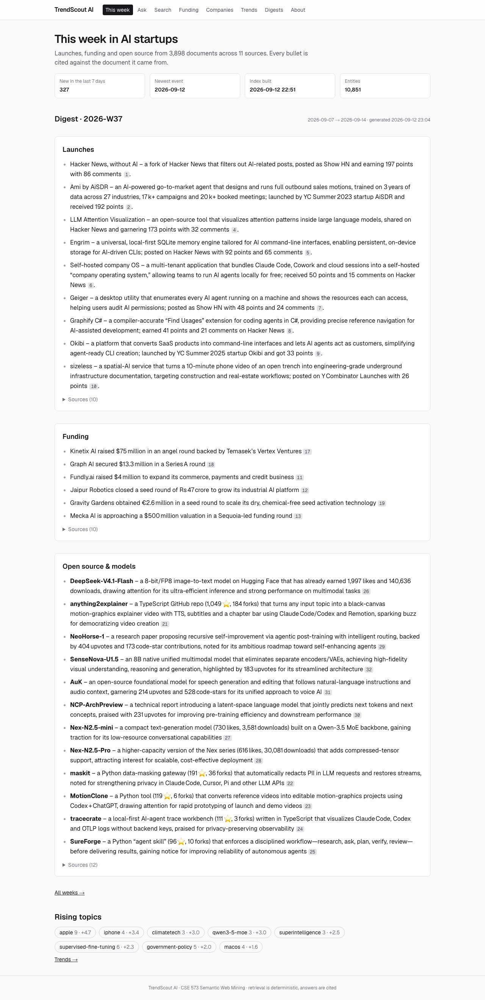
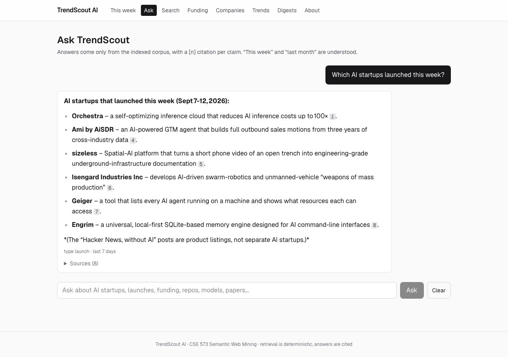
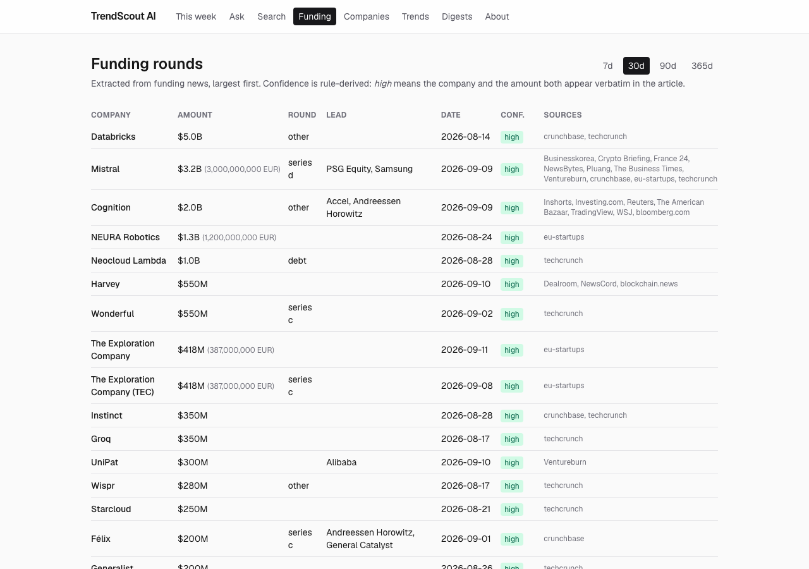
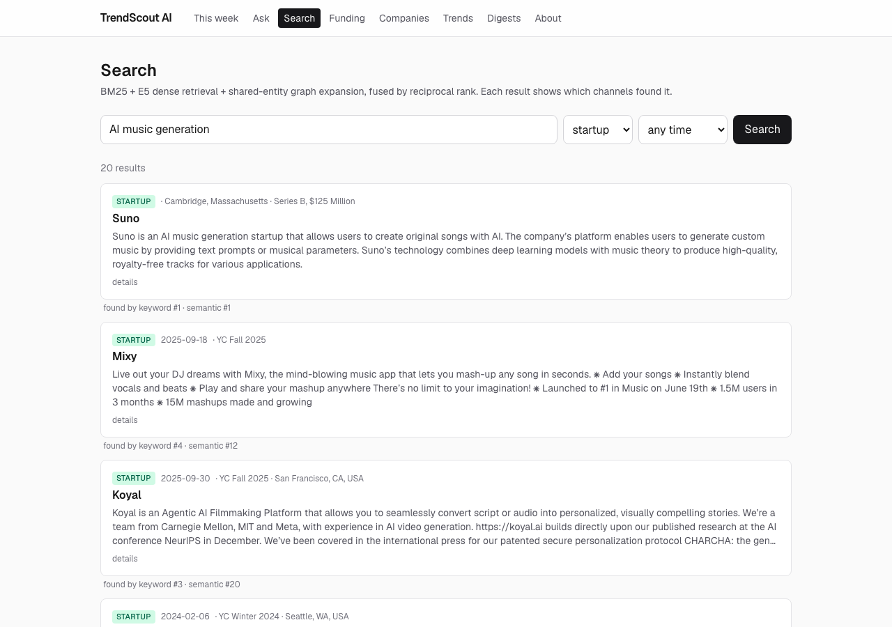
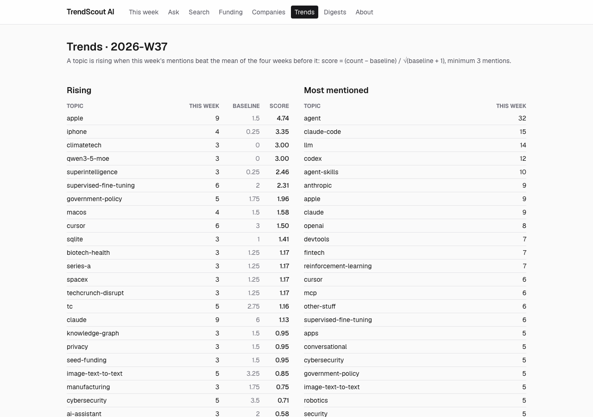

# TrendScout AI

**A live, self-updating intelligence system for the AI startup ecosystem —
every answer cited, every number traceable to its source.**

CSE 573 · Semantic Web Mining · Arizona State University

TrendScout ingests eleven public sources every week — the Y Combinator
directory and Launches, Hacker News, TechCrunch, Crunchbase News,
EU‑Startups, Google News, GitHub, Hugging Face models and papers,
StartupSavant — into one knowledge base, and answers questions like
*"Which AI startups launched this week?"*, *"Who raised the most money this
month?"* and *"What's rising?"* with citations back to the documents they
came from. When the corpus doesn't cover something, it says so.



## What it does

| | |
|---|---|
| **Weekly digest** | Launches, funding and open source for the week, written from that week's documents only. Citation numbers are assigned *before* the model writes anything, and every `[n]` is validated. |
| **Ask** | Hybrid retrieval (BM25 + E5 embeddings + a shared‑entity graph, fused by Reciprocal Rank Fusion) with a planner that understands time — "this week" becomes a real date filter, and if nothing matches, the relaxation is shown rather than hidden. |
| **Funding** | Rounds extracted from news with a structured model call, schema validation and a *rule‑derived* confidence: `high` only when the company and the amount appear verbatim in the article. Duplicates across outlets are merged. |
| **Companies** | One record per company, resolved across sources by YC slug, then website domain, then an unambiguous name — never fuzzy. |
| **Trends** | Topics counted per week from the tags each source already carries; "rising" is scored against the prior four weeks, and weeks without enough history say so. |

### Ask — cited, time‑aware answers



### Funding — extracted rounds, largest first



### Search, companies and trends

| Search with per‑channel ranks | Company page | Trends |
|---|---|---|
|  |  |  |

## The numbers

Measured on 2026‑09‑13, from the live database.

| | |
|---|---|
| Documents | **3,924** — 1,536 startups, 802 papers, 774 news articles, 492 repos, 261 launches, 53 models |
| Sources | 11, refreshed every Monday; ~450 new documents a week |
| Knowledge graph | **10,881 entities**, 20,600+ document–entity links, 1,649 entities connecting more than one document |
| Funding | **144 rounds** (~$24B), 1,664 resolved companies |
| Retrieval quality | **nDCG@10 0.882** on a frozen 210‑document snapshot with 22 labelled queries — reproducible from a fresh clone |
| Funding extraction | precision 1.00 / recall 0.93, company 27/27, amount 26/27, on 41 hand‑labelled articles |
| Tests | 327 |

## How it works, briefly

```
 11 sources ──fetch──▶ normalize ──upsert by stable key──▶ MongoDB `documents`
                                                                │
                        text changed?  ──▶ spaCy NER ──▶ entity graph
                                       ──▶ E5 embeddings ──▶ FAISS + BM25
                                       ──▶ funding extraction ──▶ rounds ──▶ companies
                                       ──▶ weekly topic counts ──▶ trends
                                                                │
   FastAPI (typed filters, rate limits, hot reload) ◀── Next.js site (Vercel)
```

Retrieval is deterministic — no model output influences ranking — so it is
reproducible and measurable. The language model (Groq, `gpt-oss-120b`)
only turns the question into a plan and writes the prose. Everything is
incremental: each document carries a hash of its indexed text, and only
documents whose text changed are re‑processed. The Monday job takes well
under a minute on a week of changes.

Full details — data model, every source, the retrieval evaluation and
ablations, the pipeline stages, the API — are in
[ARCHITECTURE.md](ARCHITECTURE.md). The plan and the log of every phase,
including what the two independent review passes found and fixed, are in
[PRD.md](PRD.md). Deployment (free tiers: MongoDB Atlas, a Hugging Face
Docker Space, GitHub Actions, Vercel) is in [DEPLOY.md](DEPLOY.md).

## Run it

```bash
python -m venv .venv && source .venv/bin/activate
pip install -r requirements.txt && python -m spacy download en_core_web_trf
cp .env.example .env                    # GROQ_API_KEY, MongoDB, optional Neo4j
brew services start mongodb-community

python scripts/ingest.py                # every source -> MongoDB
python scripts/run_pipeline.py          # entities, embeddings, indexes, funding, trends
python scripts/generate_digest.py       # this week's digest

python src/api/main.py                  # API  -> http://localhost:8000/docs
cd web && npm install && npm run dev    # site -> http://localhost:3000
```

`scripts/install_schedule.sh` installs the weekly job (launchd, Monday
08:00); `pytest tests/ -q` runs the tests (offline ones need no database).

## Stack

Python 3.13 · MongoDB · FAISS · rank‑bm25 · intfloat/e5‑base‑v2 · spaCy
(en_core_web_trf) · Groq · FastAPI · Next.js 16 / TypeScript / Tailwind ·
Neo4j (local graph view) · pytest · Docker · GitHub Actions.
